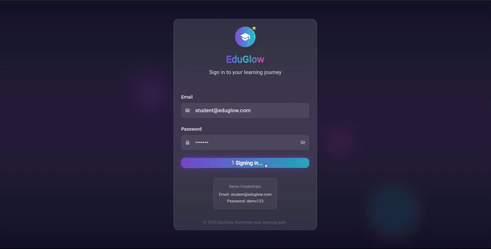
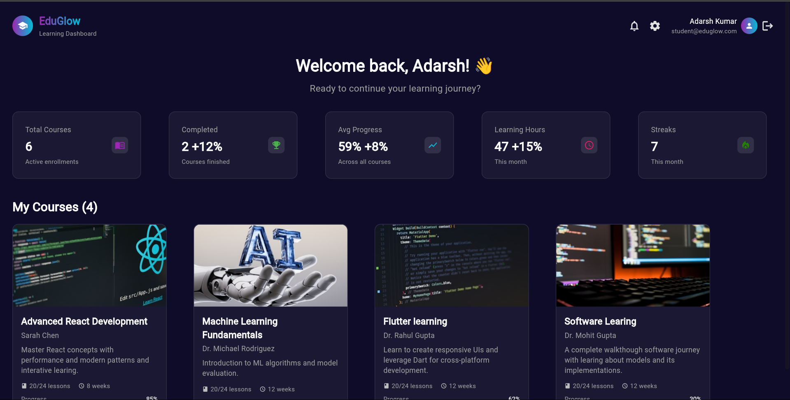
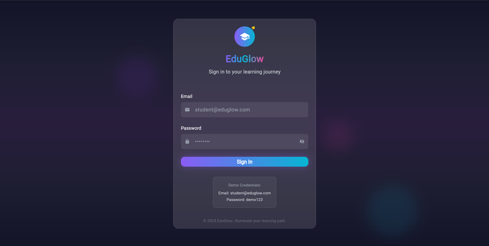

<h1 align="center">
  🎓 EduGlow – Flutter Student Dashboard
</h1>

<p align="center">
  
  
  
</p>

<h3 align="center">
  💡 Modern UI • 📊 Student Dashboard • 🌐 Responsive Design
</h3>

<p align="center">
  
</p>

---

## 🧠 About the App

**EduGlow** is a visually rich and responsive **Student Dashboard App** built with Flutter. Designed for web and desktop platforms, it helps students access their dashboard, track their learning, and explore quick links in an engaging way.

It includes:
- 🎓 Academic Dashboard
- 📅 Today’s Schedule
- 📚 Course Highlights
- 🌐 Quick Access Navigation Panel
- 📱 Responsive Layout

---

## ✨ UI Preview

<p align="center">
  
  
  
</p>

---

## 🎯 Key Features

| Feature                    | Description                                      |
|----------------------------|--------------------------------------------------|
| 📋 Responsive Layout       | Adapts seamlessly for mobile & desktop views     |
| 🔗 Sidebar Navigation      | Quick links to explore assignments, attendance   |
| 🎨 Custom UI Styling       | Vibrant gradients and hover effects              |
| 🧩 Modular Widgets         | Clean reusable widget architecture               |
| ⚡ Flutter Web Compatible  | Works well on desktop and browser                |

---

## 🧩 Tech Stack

| Technology         | Usage                          |
|--------------------|--------------------------------|
| `Flutter`          | App framework                  |
| `Stateful Widgets` | UI interactions and updates    |
| `Custom Widgets`   | Navigation cards & dashboards  |
| `Flex Layouts`     | Responsive grid implementations|

---

## 🛠 How to Run

```bash
git clone https://github.com/Adarsh-Kumar6534/eduglow.git
cd eduglow
flutter pub get
flutter run -d chrome   # or any device of your choice
